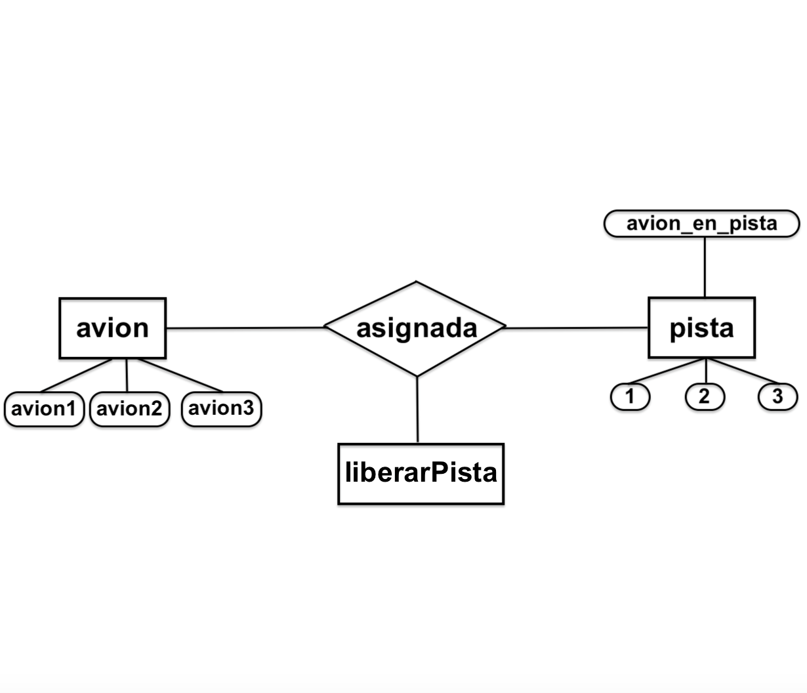

# Simulación de Aeropuerto

  

Este es un ejemplo de simulación de un aeropuerto utilizando Prolog. La simulación se centra en la asignación de pistas a aviones, la consulta de aviones asignados a pistas y la liberación de pistas.

## Modelo ER 




  

## Uso

  

1.  **Asignar una pista a un avión:**

  

Para asignar una pista a un avión, utiliza la regla `asignar_pista(Avion, Pista)`. Por ejemplo:

  

```prolog 

Consultar qué pista está asignada a un avión en particular:
?- asignar_pista(avion1, Pista2).


  

Para consultar la pista asignada a un avión específico, utiliza la regla pista_asignada(Pista, Avion). Por ejemplo:
?- pista_asignada(Pista, avion1).

  


  

Consultar qué aviones están asignados a una pista en particular:
Para consultar qué aviones están asignados a una pista específica, utiliza la regla avion_en_pista(Avion, Pista). Por ejemplo:
?- avion_en_pista(Avion, Pista2).

  


  

Liberar una pista:
Para liberar una pista, utiliza la regla liberar_pista(Pista). Por ejemplo:
?- liberar_pista(Pista1).
 
  
  

Reglas y Definiciones
pista/1: Define las pistas de aterrizaje disponibles.

avion/1: Define los aviones en cola para aterrizar.

asignar_pista/2: Regla para asignar una pista a un avión.

pista_asignada/1: Verifica si una pista está asignada.

avion_en_pista/2: Obtiene el avión asignado a una pista.

liberar_pista/1: Libera una pista asignada.

Ejemplos de uso de las reglas y definiciones.
Consultar la pista asignada a un avión

Puedes consultar la pista asignada a un avión específico utilizando la regla `pista_asignada/2`. Por ejemplo, para ver a qué pista está asignado "avion1":
  ?- pista_asignada(Pista, avion1).


Consultar los aviones asignados a una pista

Para conocer los aviones asignados a una pista en particular, utiliza la regla `avion_en_pista/2`. Aquí un ejemplo para obtener los aviones asignados a "Pista2":
?- avion_en_pista(Avion, Pista2).

Liberar una pista

Para liberar una pista, utiliza la regla `liberar_pista/1`. Por ejemplo, para liberar "Pista1":
?- liberar_pista(Pista1).
